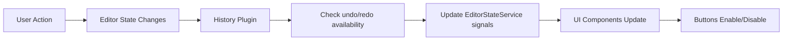

## Overview

`EditorStateService` is an Angular injectable service that manages the state of editor history operations. It uses Angular signals to track whether undo and redo operations are available, enabling reactive UI updates for history control buttons.

```typescript
@Injectable({ providedIn: 'root' })
export class EditorStateService
```

## Purpose

This service acts as a centralized state management solution for the editor's history functionality. It maintains reactive signals that components can subscribe to for updating UI elements like undo/redo buttons.

---

## Properties

### canUndo

A signal that indicates whether the undo operation is currently available.

```typescript
canUndo: WritableSignal<boolean>
```

<ResponseField name="canUndo" type="WritableSignal<boolean>">
  Angular signal that emits `true` when there are actions in the history stack that can be undone, `false` otherwise.
</ResponseField>

**Initial Value:** `false`

**Usage:**
```typescript
// In a component template
<button [disabled]="!editorState.canUndo()">Undo</button>

// In a component class
if (this.editorState.canUndo()) {
  // Undo is available
}
```

---

### canRedo

A signal that indicates whether the redo operation is currently available.

```typescript
canRedo: WritableSignal<boolean>
```

<ResponseField name="canRedo" type="WritableSignal<boolean>">
  Angular signal that emits `true` when there are actions in the undo stack that can be redone, `false` otherwise.
</ResponseField>

**Initial Value:** `false`

**Usage:**
```typescript
// In a component template
<button [disabled]="!editorState.canRedo()">Redo</button>

// In a component class
if (this.editorState.canRedo()) {
  // Redo is available
}
```

---

## Integration with History Buttons Plugin

This service is designed to work with a ProseMirror plugin that monitors the editor's history state. The plugin should update these signals whenever the editor state changes:

```typescript
import { Plugin } from 'prosemirror-state';
import { undo, redo } from 'prosemirror-history';

function historyButtonsPlugin(stateService: EditorStateService) {
  return new Plugin({
    view() {
      return {
        update(view) {
          // Check if undo is available
          const canUndoNow = undo(view.state);
          stateService.canUndo.set(canUndoNow);

          // Check if redo is available
          const canRedoNow = redo(view.state);
          stateService.canRedo.set(canRedoNow);
        }
      };
    }
  });
}
```

### How It Works

1. **Plugin monitors state**: A ProseMirror plugin watches for editor state changes
2. **Signal updates**: The plugin updates `canUndo` and `canRedo` signals based on history availability
3. **Reactive UI**: Components using these signals automatically update their UI
4. **Button states**: Undo/redo buttons enable/disable based on signal values

---

## Usage Example

### Component Implementation

```typescript
import { Component, inject } from '@angular/core';
import { EditorStateService } from './editor-state.service';
import { EditorView } from 'prosemirror-view';
import { undo, redo } from 'prosemirror-history';

@Component({
  selector: 'app-editor-toolbar',
  template: `
    <div class="toolbar">
      <button 
        (click)="handleUndo()"
        [disabled]="!editorState.canUndo()">
        Undo
      </button>
      
      <button 
        (click)="handleRedo()"
        [disabled]="!editorState.canRedo()">
        Redo
      </button>
    </div>
  `,
  styles: [`
    button:disabled {
      opacity: 0.5;
      cursor: not-allowed;
    }
  `]
})
export class EditorToolbarComponent {
  editorState = inject(EditorStateService);
  editorView: EditorView; // injected or passed from parent

  handleUndo() {
    if (this.editorState.canUndo()) {
      undo(this.editorView.state, this.editorView.dispatch);
    }
  }

  handleRedo() {
    if (this.editorState.canRedo()) {
      redo(this.editorView.state, this.editorView.dispatch);
    }
  }
}
```

### Standalone Component with Signals

```typescript
import { Component, computed, inject } from '@angular/core';
import { EditorStateService } from './editor-state.service';

@Component({
  selector: 'app-history-status',
  template: `
    <div class="status">
      {{ historyStatus() }}
    </div>
  `,
  standalone: true
})
export class HistoryStatusComponent {
  private editorState = inject(EditorStateService);

  historyStatus = computed(() => {
    const canUndo = this.editorState.canUndo();
    const canRedo = this.editorState.canRedo();
    
    if (!canUndo && !canRedo) return 'No history';
    if (canUndo && canRedo) return 'Can undo and redo';
    if (canUndo) return 'Can undo';
    return 'Can redo';
  });
}
```

---

## State Management Flow



1. User performs an action (typing, formatting, etc.)
2. Editor state changes in ProseMirror
3. History buttons plugin detects the change
4. Plugin checks if undo/redo commands are available
5. Plugin updates `canUndo` and `canRedo` signals
6. Angular's change detection updates all components using these signals
7. UI reflects current history state

---

## Benefits of Signal-Based State

- **Reactive**: Components automatically update when signals change
- **Performant**: Angular's signal system is optimized for fine-grained reactivity
- **Type-safe**: Full TypeScript support with proper typing
- **Centralized**: Single source of truth for history state across all components
- **Testable**: Easy to mock and test signal values

---

## Testing

```typescript
import { TestBed } from '@angular/core/testing';
import { EditorStateService } from './editor-state.service';

describe('EditorStateService', () => {
  let service: EditorStateService;

  beforeEach(() => {
    TestBed.configureTestingModule({});
    service = TestBed.inject(EditorStateService);
  });

  it('should initialize with canUndo as false', () => {
    expect(service.canUndo()).toBe(false);
  });

  it('should initialize with canRedo as false', () => {
    expect(service.canRedo()).toBe(false);
  });

  it('should update canUndo signal', () => {
    service.canUndo.set(true);
    expect(service.canUndo()).toBe(true);
  });

  it('should update canRedo signal', () => {
    service.canRedo.set(true);
    expect(service.canRedo()).toBe(true);
  });
});
```
