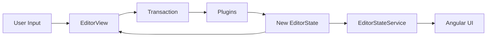

Euclides Rich Editor is built on top of [ProseMirror](https://prosemirror.net/), a powerful toolkit for building rich text editors. This page explains the core architecture and how it integrates with Angular.

## ProseMirror Core Concepts

ProseMirror is built around three main concepts that work together to create a functional editor:

### EditorState

**EditorState** is the complete, immutable representation of the editor at any given moment. It contains:

- The current **document** (all content)
- The **selection** (cursor position or text selection)
- Active **plugins** and their state
- Internal tracking information

<Note>
The state is immutable. Every change creates a new state through transactions, making undo/redo and time-travel debugging possible.
</Note>

### EditorView

**EditorView** is the visual representation of the editor that renders in the DOM. It:

- Takes an EditorState and displays it
- Handles user interactions (typing, clicking, selecting)
- Dispatches transactions to update the state
- Re-renders when the state changes

### Schema

**Schema** is the "dictionary" that defines what types of content are allowed in your editor. It specifies:

- What **nodes** exist (paragraph, heading, list, code_block, etc.)
- What **marks** exist (bold, italic, link, strike, etc.)
- How they parse from HTML and serialize back to HTML
- What attributes they can have

See [Schema](/concepts/schema) for detailed information.

## Angular Integration

Euclides Rich Editor bridges ProseMirror's functional architecture with Angular's component-based system.

### Component Structure

The main editor component is `EuclidesRichEditorComponent` (euclides-rich-editor.component.ts:20):

```typescript
@Component({
  selector: 'euclides-rich-editor',
  standalone: true,
  templateUrl: './euclides-editor.component.html',
  imports: [LinkPopoverComponent],
})
export class EuclidesRichEditorComponent implements AfterViewInit, OnDestroy {
  editorCommandsService = inject(EditorCommandsService);
  editorStateService = inject(EditorStateService);

  @ViewChild('editor', { static: true })
  editorRef!: ElementRef<HTMLDivElement>;

  view!: EditorView;

  ngAfterViewInit() {
    this.view = EditorEngine.create(
      this.editorRef.nativeElement, 
      this.editorStateService
    );
  }
}
```

Key aspects:

1. **ViewChild reference** - Gets the DOM element where the editor will mount
2. **ngAfterViewInit** - Creates the editor after Angular renders the view
3. **Services** - Injects Angular services for commands and state management

### EditorEngine: The Factory

The `EditorEngine` class provides a factory method to create fully configured editor instances (editor-engine.ts:18):

```typescript
export class EditorEngine {
  static create(element: HTMLElement, stateService: EditorStateService): EditorView {
    const state = EditorState.create({
      // The Schema establishes document rules
      schema: EuclidesEditorSchema,

      /* 
       * Plugins extend editor behavior:
       * - Keyboard shortcuts
       * - History (undo/redo)
       * - Custom logic
       * - Sync with EditorStateService (Angular)
       */
      plugins: buildPlugins(stateService)
    });

    return new EditorView(element, {
      state,
      attributes: { class: 'euclides-editor' }
    });
  }
}
```

<Info>
This factory pattern separates ProseMirror initialization from Angular component lifecycle, making the code more testable and maintainable.
</Info>

### State Management Bridge

The `EditorStateService` (editor-state.service.ts:4) bridges ProseMirror state with Angular's reactive system:

```typescript
@Injectable({ providedIn: 'root' })
export class EditorStateService {
  canUndo = signal(false);
  canRedo = signal(false);
}
```

This service uses Angular signals to expose editor state to the UI. Plugins update these signals when the editor state changes, allowing Angular components to react and update the toolbar buttons accordingly.

## Plugin System

Plugins extend the editor's functionality. Euclides uses a modular plugin system (euclides-plugins.ts:31):

```typescript
export function buildPlugins(stateService: EditorStateService) {
  return [
    buildEuclidesKeymap(EuclidesEditorSchema), // Custom keyboard shortcuts
    keymap(baseKeymap),                        // Base ProseMirror shortcuts
    history(),                                 // Undo/redo functionality
    buildHistoryStatePlugin(stateService),     // Sync with Angular state
  ];
}
```

<Tip>
Plugin order matters! Custom keymaps are registered first so they can override default behaviors.
</Tip>

### What Plugins Do

Plugins can:

- **Handle keyboard shortcuts** - Custom key bindings for formatting
- **Implement undo/redo** - History tracking and restoration
- **Add input rules** - Automatic formatting as you type (e.g., `**bold**` → **bold**)
- **React to state changes** - Update Angular services when editor state changes
- **Modify transactions** - Transform or validate changes before they're applied

## Data Flow

Here's how data flows through the architecture:

1. **User types** → EditorView captures the event
2. **View creates transaction** → Describes the change
3. **Plugins process transaction** → Can modify or cancel it
4. **Transaction applied** → Creates new EditorState
5. **View updates** → Re-renders with new state
6. **Angular services notified** → Update signals for UI reactivity



## Command Pattern

Euclides uses Angular services to encapsulate editor commands (euclides-rich-editor.component.ts:41):

```typescript
toggleBold() {
  if (this.editorCommandsService.toggleBold(this.view)) {
    this.view.focus();
  }
}

toggleAlign(align: string) {
  if (this.editorCommandsService.setTextAlign(align, this.view))
    this.view.focus();
}
```

This pattern:

- Keeps components focused on UI logic
- Makes commands reusable and testable
- Returns boolean indicating if the command succeeded
- Maintains focus after successful operations

## Why This Architecture?

<Accordion title="Separation of Concerns">
  ProseMirror handles document model and editing logic, while Angular handles UI components and state management. Each does what it's best at.
</Accordion>

<Accordion title="Immutability">
  EditorState immutability makes undo/redo trivial, enables time-travel debugging, and prevents bugs from shared mutable state.
</Accordion>

<Accordion title="Extensibility">
  The plugin system allows adding features without modifying core code. New behaviors are composed through plugins.
</Accordion>

<Accordion title="Type Safety">
  TypeScript and ProseMirror's schema system provide compile-time guarantees about document structure.
</Accordion>

## Next Steps

<CardGroup cols={2}>
  <Card title="Schema" icon="book" href="/concepts/schema">
    Learn how to define document structure
  </Card>
  <Card title="Nodes vs Marks" icon="shapes" href="/concepts/nodes-vs-marks">
    Understand content vs formatting
  </Card>
  <Card title="Editor State" icon="database" href="/concepts/editor-state">
    Deep dive into state management
  </Card>
</CardGroup>