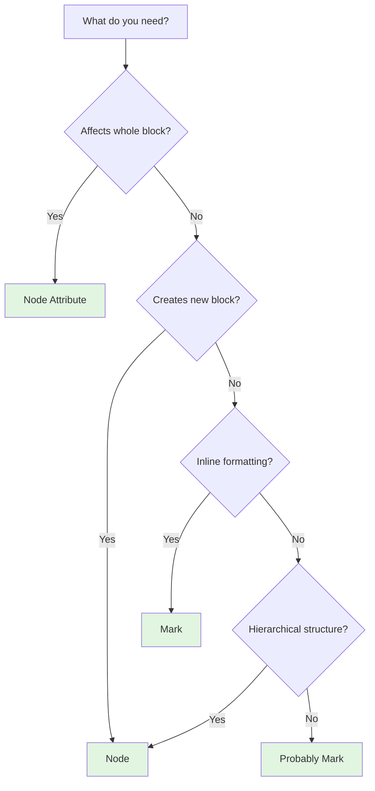

One of the most important concepts in ProseMirror (and Euclides) is understanding the distinction between **nodes** and **marks**. Getting this right is crucial for designing your schema and implementing features.

## The Golden Rule

<Note>
**If it modifies structure** → use a **NODE**  
**If it modifies text formatting** → use a **MARK**
</Note>

## What are Nodes?

**Nodes** are the building blocks of your document structure. They are "containers" that define the layout and hierarchy.

### Characteristics of Nodes

- Form the **tree structure** of the document
- Can contain **other nodes** or **text**
- **Cannot overlap** - they have clear boundaries
- Have a **type** and optional **attributes**
- Examples: paragraphs, headings, lists, code blocks, images

### Node Examples from Euclides

Here are the nodes available in EuclidesEditorSchema:

| Node Type | HTML Tag | Description | Can Contain |
|-----------|----------|-------------|-------------|
| `doc` | - | Root document | block nodes |
| `paragraph` | `<p>` | Text paragraph | inline content |
| `heading` | `<h1>`–`<h6>` | Headings | inline content |
| `blockquote` | `<blockquote>` | Block quote | block nodes |
| `code_block` | `<pre><code>` | Code block | text only |
| `bullet_list` | `<ul>` | Unordered list | list_item |
| `ordered_list` | `<ol>` | Ordered list | list_item |
| `list_item` | `<li>` | List item | paragraph + blocks |
| `horizontal_rule` | `<hr>` | Divider | nothing (leaf) |
| `image` | `` | Image | nothing (leaf) |
| `hard_break` | `<br>` | Line break | nothing (leaf) |
| `text` | - | Text content | - |

### Node Attributes: Paragraph with Text Alignment

Nodes can have **attributes** that affect the entire block. Euclides extends the paragraph node with a `textAlign` attribute (euclides-schema.ts:10):

```typescript
const paragraph: NodeSpec = {
  ...schema.spec.nodes.get('paragraph'),
  attrs: {
    textAlign: { default: 'left' }
  },
  parseDOM: [
    {
      tag: "p",
      getAttrs: (dom: HTMLElement) => ({
        textAlign: dom.style.textAlign || "left"
      })
    }
  ],
  toDOM(node: Node) {
    return [
      "p",
      { style: `text-align:${node.attrs['textAlign']}` },
      0
    ];
  }
};
```

This renders as:

```html
<p style="text-align:center">Hello world</p>
```

<Info>
**Why is textAlign a node attribute and not a mark?**  
Because text alignment affects the **entire block**, not individual words. You can't have half a paragraph left-aligned and half right-aligned.
</Info>

### When to Use a Node

Use a node when you need to:

- Create a **new block** or structural element
- Define **hierarchical relationships** (lists, nested quotes)
- Apply properties to an **entire block** (alignment, indentation)
- Create **leaf nodes** that don't contain text (images, hr, embed)
- Control **content rules** ("this can only contain list items")

## What are Marks?

**Marks** are inline styles applied to text within a node. They "decorate" text without changing structure.

### Characteristics of Marks

- Apply to **ranges of text** within a node
- **Can overlap** - text can be bold *and* italic
- Have a **type** and optional **attributes**
- Don't affect **document structure**
- Examples: bold, italic, links, strikethrough, text color

### Mark Examples from Euclides

Euclides includes these marks:

| Mark Type | HTML Tag | Description | Has Attributes |
|-----------|----------|-------------|----------------|
| `strong` | `<strong>` | Bold text | No |
| `em` | `<em>` | Italic text | No |
| `link` | `<a>` | Hyperlink | Yes (href, title) |
| `code` | `<code>` | Inline code | No |
| `strike` | `<s>` | Strikethrough | No |

### Custom Mark: Strike (Strikethrough)

Euclides adds strikethrough as a custom mark because it's not included in `prosemirror-schema-basic` (euclides-schema.ts:37):

```typescript
const strike: MarkSpec = {
  parseDOM: [
    { tag: "s" },
    { tag: "del" },
    { style: "text-decoration=line-through" }
  ],
  toDOM() {
    return ["s", 0];
  }
};

// Add to schema
marks: basicSchema.spec.marks.addToEnd("strike", strike)
```

This renders as:

```html
<p>Hello <s>world</s></p>
```

<Tip>
**Why is strike a mark and not a node?**  
Because strikethrough applies to **portions of text** within a paragraph, not the whole block. You can strike through individual words.
</Tip>

### Mark Attributes: Links

Marks can have attributes too. The `link` mark has `href` and `title` attributes:

```typescript
// From euclides-rich-editor.component.ts:106
const linkInfo = getLinkRange(state);
if (linkInfo) {
  const { start, end } = linkInfo;
  
  dispatch(
    state.tr
      .removeMark(start, end, state.schema.marks['link'])
      .addMark(
        start,
        end,
        state.schema.marks['link'].create({
          href: url,
          title: linkInfo.link.attrs['title']
        })
      )
  );
}
```

### Mark Overlap

Unlike nodes, marks can overlap freely:

```html
<p>This is <strong>bold and <em>italic</em></strong> text</p>
```

In ProseMirror's internal representation:

- "This is " → no marks
- "bold and " → `[strong]` mark
- "italic" → `[strong, em]` marks (both!)
- " text" → no marks

<Note>
Marks are stored as a flat list on each character. The renderer figures out how to nest the HTML tags optimally.
</Note>

### When to Use a Mark

Use a mark when you need to:

- Apply **inline styling** to text
- Support **overlapping styles** (bold + italic + link)
- Style **portions of text** within a block
- Add **character-level metadata** (like link URLs)
- Implement **text highlighting** or colors

## Real-World Examples

Let's look at how the README explains this distinction:

### Example 1: Paragraph Alignment (Node Attribute)

From README.md:44:

> If you want to modify the ENTIRE block, do it as a node attribute.
>
> Example:
> ```html
> <p style="text-align:center">Hello world</p>
> ```
>
> That lives in: `nodes → paragraph.attrs`

This is a **node attribute** because alignment affects the whole paragraph.

### Example 2: Strikethrough Text (Mark)

From README.md:62:

> Marks DON'T change the structure.  
> They only wrap parts of the text.
>
> Example:
> ```html
> <p>Hello <s>world</s></p>
> ```
>
> Here the block is the paragraph,  
> but "world" has a MARK.

This is a **mark** because it affects only the word "world".

## Decision Tree

Use this flowchart to decide between node and mark:



## Common Patterns

<Accordion title="Text Color">
  **MARK** - Applies to individual words or characters within a paragraph.
  
  ```typescript
  const textColor: MarkSpec = {
    attrs: { color: {} },
    parseDOM: [{
      style: "color",
      getAttrs: color => ({ color })
    }],
    toDOM(mark) {
      return ["span", { style: `color:${mark.attrs.color}` }, 0];
    }
  };
  ```
</Accordion>

<Accordion title="Background Color">
  **MARK** - Highlights individual text ranges, not entire blocks.
  
  ```typescript
  const backgroundColor: MarkSpec = {
    attrs: { color: {} },
    parseDOM: [{
      style: "background-color",
      getAttrs: color => ({ color })
    }],
    toDOM(mark) {
      return ["span", { style: `background-color:${mark.attrs.color}` }, 0];
    }
  };
  ```
</Accordion>

<Accordion title="Tables">
  **NODES** - Tables are structural with clear hierarchy: table → row → cell.
  
  You need separate node types for:
  - `table` (contains rows)
  - `table_row` (contains cells)
  - `table_cell` (contains blocks)
  - `table_header` (contains blocks)
</Accordion>

<Accordion title="Font Size">
  **MARK** - Usually applied to text ranges, though you could argue for a node attribute if you want entire paragraphs with consistent size.
  
  Common implementation:
  ```typescript
  const fontSize: MarkSpec = {
    attrs: { size: {} },
    parseDOM: [{
      style: "font-size",
      getAttrs: size => ({ size })
    }],
    toDOM(mark) {
      return ["span", { style: `font-size:${mark.attrs.size}` }, 0];
    }
  };
  ```
</Accordion>

<Accordion title="Custom Blocks (Warning, Info)">
  **NODES** - These create new block types with special rendering.
  
  ```typescript
  const warningBlock: NodeSpec = {
    group: "block",
    content: "inline*",
    parseDOM: [{ tag: "div.warning" }],
    toDOM() {
      return ["div", { class: "warning" }, 0];
    }
  };
  ```
</Accordion>

## What's NOT Included by Default

From README.md:108, here's what you need to add yourself:

### Marks to Add (Text modifications)

- ❌ Underline → `<u>text</u>`
- ❌ Text color → red, blue text, etc.
- ❌ Background/highlight → word backgrounds
- ❌ Font size → text size
- ❌ Font family → typeface

### Nodes to Add (Structure modifications)

- ❌ Tables → `table`, `row`, `cell`, `header`
- ❌ Video embeds → `<iframe>`, `<video>`
- ❌ Mentions (@user) → special inline node
- ❌ Custom blocks → warning, info, success boxes
- ❌ Cards/embeds → Notion-style previews
- ❌ Columns/layouts
- ❌ Checklists

<Warning>
Note that **textAlign is already included** in Euclides as a paragraph attribute (euclides-schema.ts:10).
</Warning>

## Toggling Marks in Components

Here's how the editor component toggles marks (euclides-rich-editor.component.ts:41):

```typescript
toggleBold() {
  if (this.editorCommandsService.toggleBold(this.view)) {
    this.view.focus();
  }
}

toggleItalic() {
  if (this.editorCommandsService.toggleItailc(this.view)) {
    this.view.focus();
  }
}

toggleStrike() {
  if (this.editorCommandsService.toggleStrike(this.view))
    this.view.focus();
}
```

These use ProseMirror's `toggleMark` command under the hood, which:

1. Checks if the mark is active in the selection
2. If active, removes it
3. If not active, adds it
4. Returns `true` if successful

## Next Steps

<CardGroup cols={2}>
  <Card title="Schema" icon="book" href="/concepts/schema">
    Deep dive into schema definition
  </Card>
  <Card title="Editor State" icon="database" href="/concepts/editor-state">
    Learn about transactions and state
  </Card>
</CardGroup>